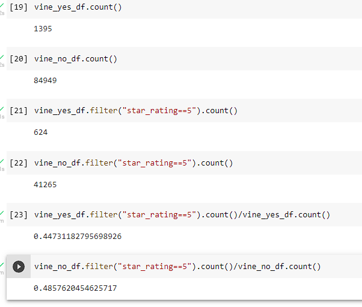

# Amazon_Vine_Analysis Module 16 UofT Data bootcamp

## Overview
### Purpose

Examining a publicly available Amazon review dataset from [Amazon Review Dataset](https://s3.amazonaws.com/amazon-reviews-pds/tsv/index.txt) , an analysis of the Vine program was performed. The Vine program is an Amazon program that pays reviewers to review items listed on Amazon. The Home dataset was chosen to conduct the analysis.

## Results

  
Vine Results Table

- 1395 reviews were vine results
- 84949 reviews were non-Vine results
- 624 vine reviews were 5 stars
- 41265 non-vine reviews were 5 stars
- 44.7% of the vine reviews were 5 stars
- 48.6% of the non-vine reviews were 5 stars

## Summary

Comparing the two resulting percentages of 5 star reviews, one can say there is unlikely a positivity bias for reviews in the Vine program. Additional statistical analysis could be done to determine if there is any significant difference in the likelyhood of 5 star vine reviews versus non-vine reviews. This could be done using just one dataset or across all datasets.
